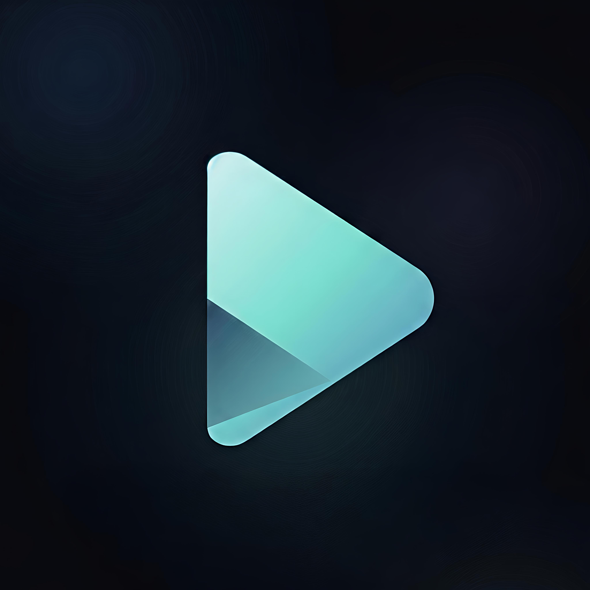
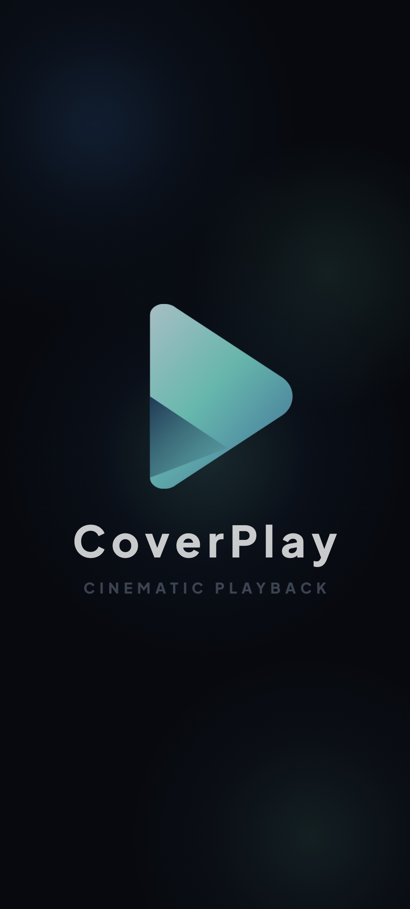
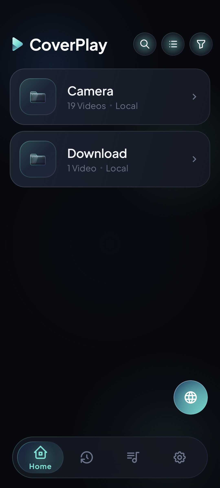
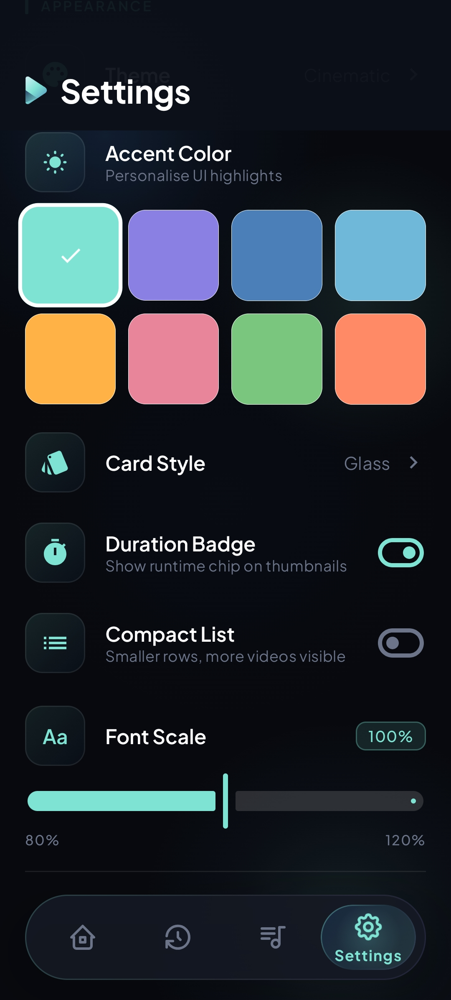

<div align="center">

# 🎬 CoverPlay

### Premium • Beautiful • Powerful Android Video Player



Modern Android video player built with **Kotlin**, **Jetpack Compose**, and **Media3**.

---


⭐ If you like this project, please Star the repository.

</div>

---

# 📸 Screenshots

<p align="center">







</p>

---

# ✨ Features

### 🎥 Playback

- Hardware Accelerated Playback
- Smooth 4K Playback
- Playback Speed Controls
- Resume Playback
- Background Playback
- Multiple Aspect Ratios

### 👆 Gesture Controls

- Double Tap to Seek
- Brightness Control
- Volume Control
- Swipe to Seek
- Screen Lock

### 💬 Subtitle Support

- Online Subtitle Download
- External Subtitle Files
- Subtitle Styling
- Multiple Subtitle Formats

### 📂 Library

- Automatic Video Scan
- Folder Browser
- Recent Videos
- Video Information
- HD & UHD Detection

### 🎨 Design

- Material Design 3
- Premium Animations
- Beautiful Typography
- Dark Theme
- Responsive UI

---

# 🚀 Why CoverPlay?

✅ Fast

✅ Lightweight

✅ Modern UI

✅ Gesture Based Controls

✅ Premium Experience

✅ Built using latest Android technologies

---

# 🛠 Tech Stack

| Technology | Used |
|------------|------|
| Kotlin | ✅ |
| Jetpack Compose | ✅ |
| Media3 / ExoPlayer | ✅ |
| Material Design 3 | ✅ |
| Android Studio | ✅ |

---

# 📱 Minimum Requirements

Android 8.0 (API 26)+

---

# 📂 Project Structure

```
app/
 ├── ui/
 ├── player/
 ├── subtitles/
 ├── gestures/
 ├── utils/
 ├── models/
 └── data/
```

---

# 🗺 Roadmap

- [x] Local Video Playback
- [x] Gesture Controls
- [x] Subtitle Support
- [x] Material Design UI
- [ ] Chromecast
- [ ] Picture in Picture
- [ ] Playlist Support
- [ ] Sleep Timer
- [ ] SMB / FTP Streaming
- [ ] Cloud Storage Support

---

# ⚡ Installation

```bash
git clone https://github.com/YOUR_USERNAME/CoverPlay.git
```

Open in Android Studio

Build

Run

---

# 🤝 Contributing

Contributions are welcome!

Open an Issue or submit a Pull Request.

---

# 📜 License

MIT License

---

<div align="center">

## ❤️ Built with Kotlin & Jetpack Compose

**Designed for speed. Built for simplicity.**

⭐ Star the repository if you enjoyed the project!

</div>
